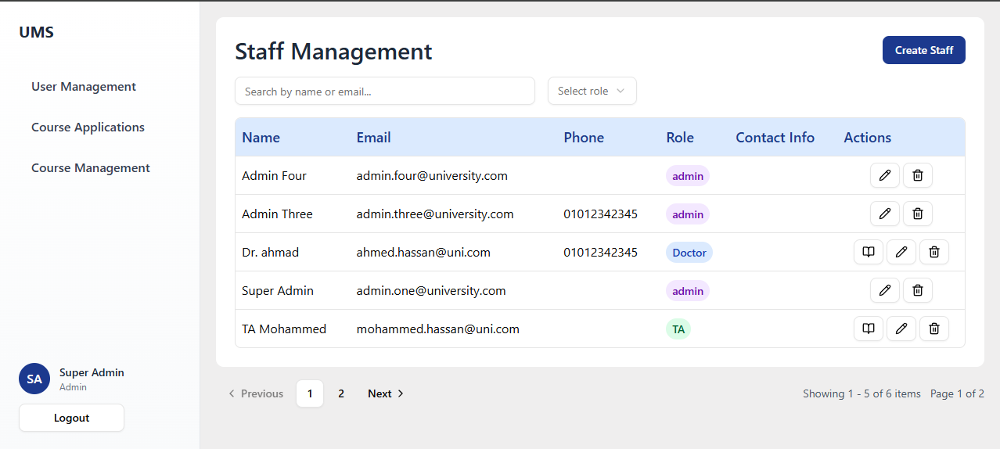
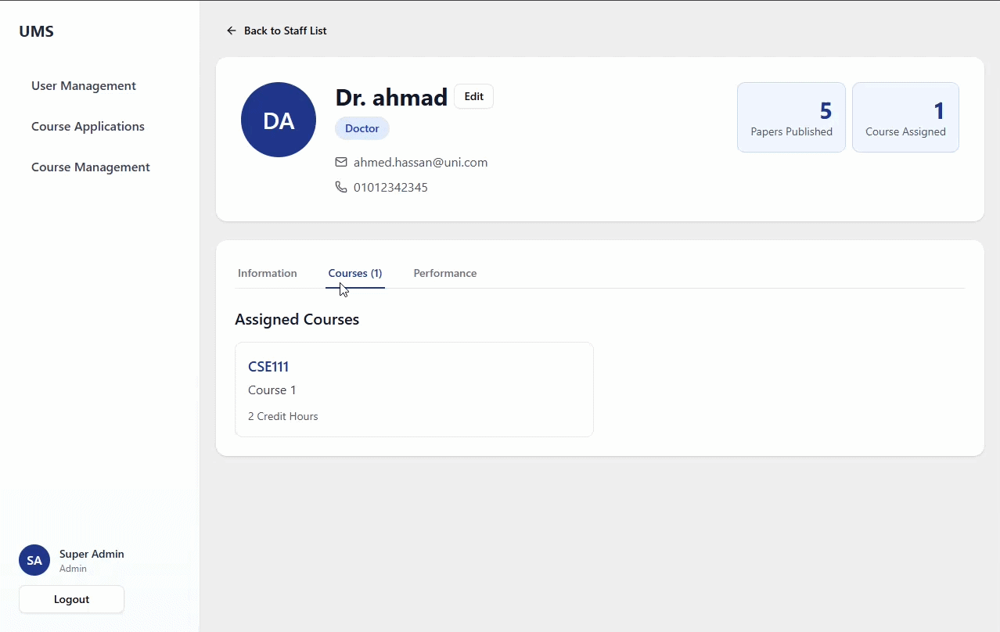
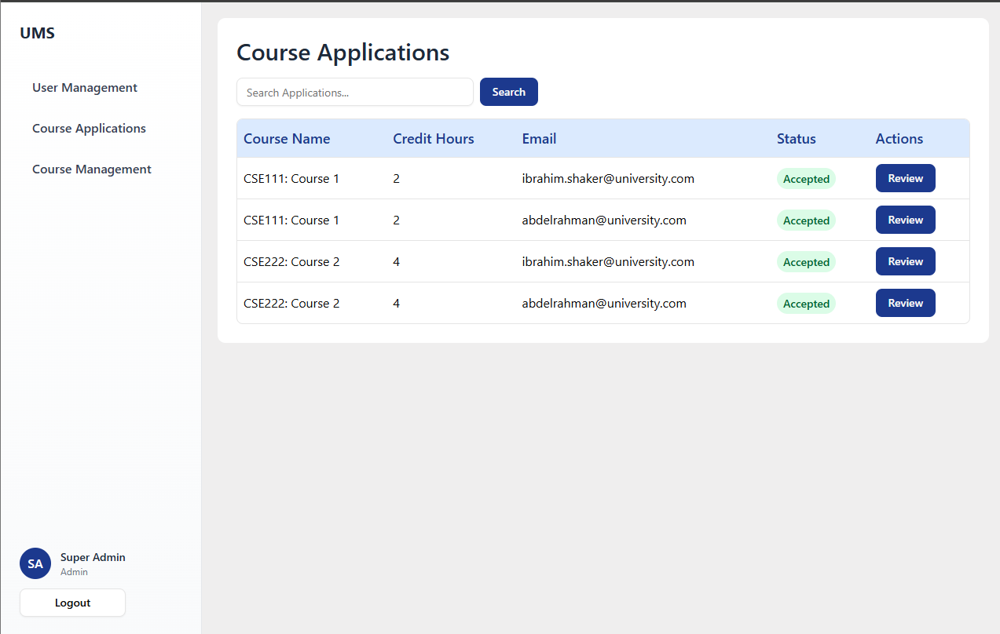
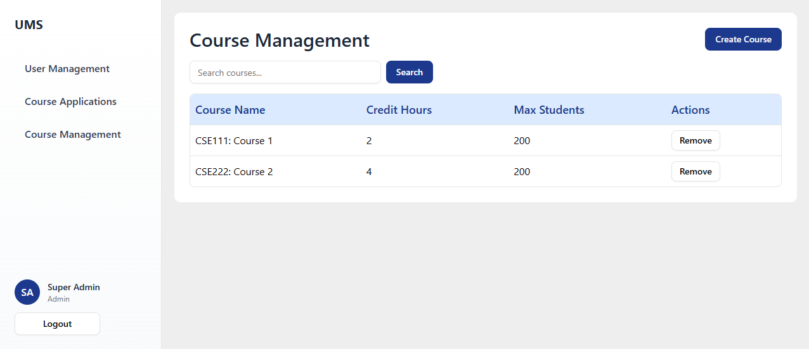
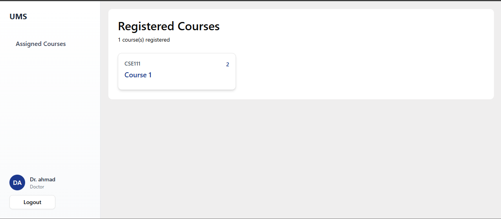
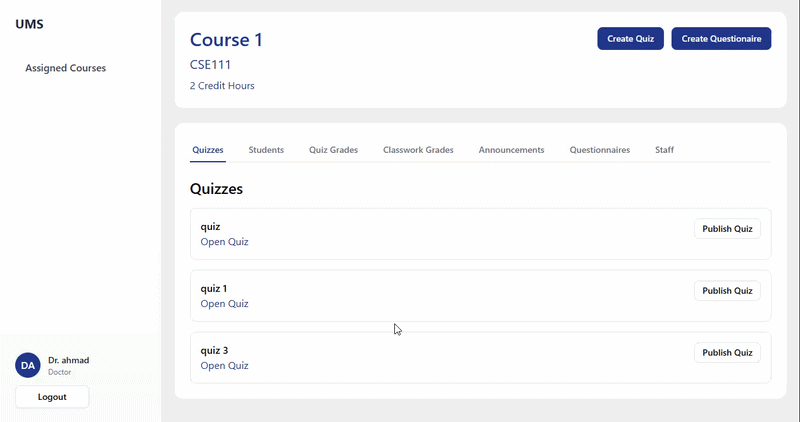
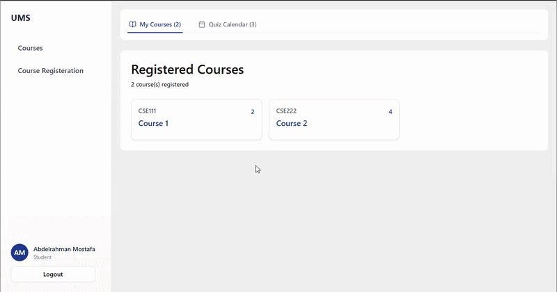
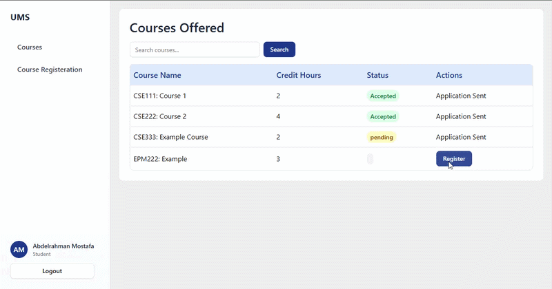
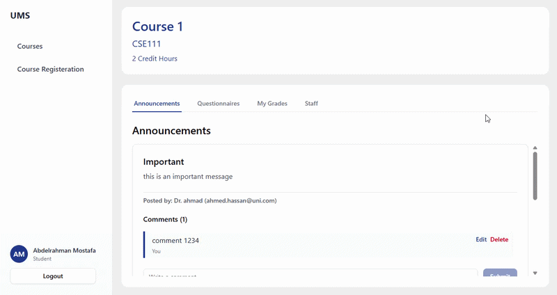

# University Management System

A full-stack university management platform built with **Next.js**, featuring a role-based experience for Admins, Doctors, Teaching Assistants, and Students. The system streamlines course management, student registration, quizzes, grading, and staff administration — all within a clean, modern UI.

---

## Tech Stack

- **Framework:** Next.js (App Router)
- **UI Components:** [shadcn/ui](https://ui.shadcn.com/)
- **Auth & Roles:** Role-based access control through JWT (Admin / Doctor / TA / Student)

---

## Key Features

### Role-Based Sidebar Navigation
Every user sees a tailored sidebar based on their role — Admins get management tools, Doctors and TAs get course controls, and Students get their learning dashboard. No clutter, no confusion.

### Staff Management (Admin)
Full CRUD over staff members with role assignment and course linking — searchable by email and filterable by role for fast lookups.

### Smart Course Applications
Admins can review, accept, or reject student course applications with an email-based search, making enrollment management effortless.

### In-Course Assessment Suite (Doctor / TA)
Instructors can create quizzes and questionnaires, publish them on their own schedule, and grade students both per-quiz and holistically — all from within the individual course page.

### Announcements & Interaction
Doctors/TAs publish announcements; students can read and comment on them — fostering communication without leaving the platform.

### Student Quiz Calendar
Students see all their upcoming quizzes in a calendar view alongside their registered courses, helping them stay on top of deadlines.

### Server Actions
All client–server communication is handled via Next.js Server Actions (BFF) for added security.

---

## Screenshots

### Admin Panel

#### Staff Management
<!-- Screenshot: Staff management page with role filter and email search -->

---

#### Individual Staff Profile
<!-- Screenshot: Staff profile with personal info, assigned courses, and performance metrics -->

---

#### Course Applications
<!-- Screenshot: Course applications review page -->

---

#### Course Management
<!-- Screenshot: Course management page -->

---

### Doctor / TA Panel

#### Assigned Courses
<!-- Screenshot: List of assigned courses for doctor/TA -->

---

#### Individual Course Page
<!-- Screenshot: Course detail page with quiz creation, grading, and announcement tools -->


---

### Student Panel

#### My Courses & Quiz Calendar
<!-- Screenshot: Student courses list alongside quiz calendar -->


---

#### Course Registration
<!-- Screenshot: Course search and application page -->

---

#### Individual Course Page (Student View)
<!-- Screenshot: Student view of course with announcements, quizzes, and grades -->



---

## Project Structure

```

[app]
    ├── [admin]
        ├── actions.ts
        ├── [components]
            ├── AssignCourse.tsx
            ├── CreateStaff.tsx
            ├── EditStaff.tsx
            └── staffTable.tsx
        ├── page.tsx
        └── [[id]]
            ├── [components]
                └── EditStaff.tsx
            └── page.tsx
    ├── [Courses]
        ├── [admin]
            ├── actions.ts
            ├── [components]
                ├── CourseTable.tsx
                └── CreateCourse.tsx
            └── page.tsx
        ├── [Doctor]
            ├── actions.tsx
            ├── page.tsx
            └── [[id]]
                ├── [components]
                    ├── ClassworkGradesTable.tsx
                    ├── CreateAnnoucment.tsx
                    ├── CreateQuestionaire.tsx
                    ├── CreateQuiz.tsx
                    ├── DialogSetQuizDueDate.tsx
                    ├── EditAnnouncement.tsx
                    ├── GradeStudent.tsx
                    ├── StudentsGrades.tsx
                    └── StudentsTable.tsx
                └── page.tsx
        └── [student]
            ├── actions.tsx
            ├── page.tsx
            └── [[id]]
                ├── [components]
                    └── EditComment.tsx
                └── page.tsx
    ├── [dashboard]
        └── page.tsx
    ├── favicon.ico
    ├── globals.css
    ├── layout.tsx
    ├── [lib]
        └── utils.tsx
    ├── [login]
        ├── page.tsx
        └── [repositories]
            └── actions.ts
    ├── page.tsx
    ├── [registeration]
        ├── [staff]
            ├── actions.ts
            ├── [components]
                ├── CourseTable.tsx
                └── ReviewApplication.tsx
            └── page.tsx
        └── [student]
            ├── actions.ts
            ├── [components]
                ├── CourseTable.tsx
                └── RegisterCourse.tsx
            └── page.tsx
    ├── [staff]
        └── page.tsx
    └── [student]
        └── page.tsx
[common]
    └── cookieHelpers.ts
[components]
    ├── CustomPagination.tsx
    ├── ProtectedRoutes.tsx
    ├── sidebar.tsx
    └── [ui]
        ├── button.tsx
        ├── datatable.tsx
        ├── dialog.tsx
        ├── input.tsx
        ├── pagination.tsx
        ├── select.tsx
        ├── switch.tsx
        ├── table.tsx
        └── tabs.tsx
```

---

## Getting Started

### Prerequisites
- Node.js 18+
- npm / yarn / pnpm

### Installation

```bash

# Install dependencies
npm install

# Run the development server
npm run dev
```

Open [http://localhost:3000](http://localhost:3000) in your browser.

---

## User Roles

| Role | Capabilities |
|------|-------------|
| **Admin** | Manage staff, assign courses, review applications, create/remove courses |
| **Doctor** | View assigned courses, create quizzes & questionnaires, grade students, post announcements |
| **Teaching Assistant (TA)** | Same as Doctor — scoped to assigned courses |
| **Student** | Register for courses, take quizzes & questionnaires, view grades, comment on announcements |

---