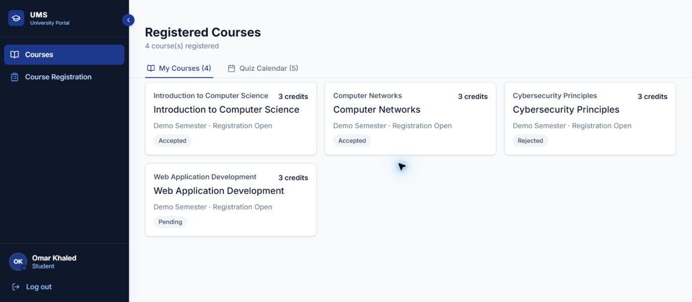
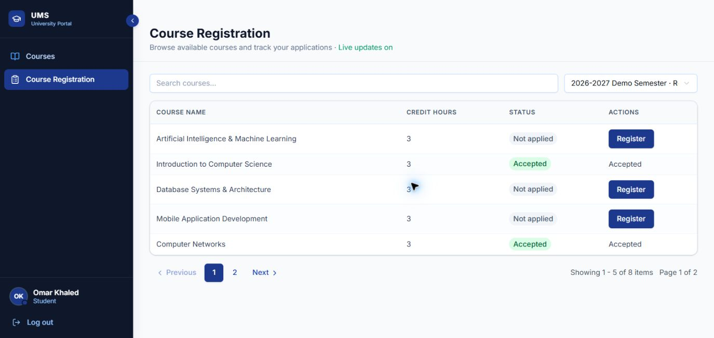
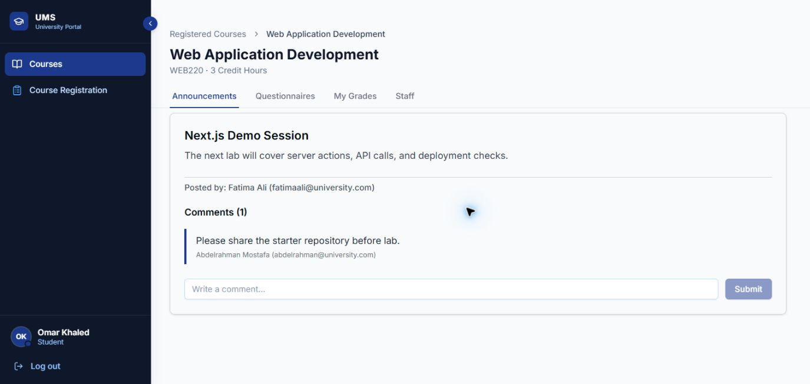
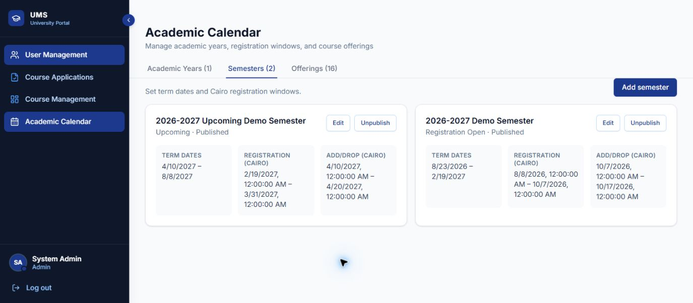
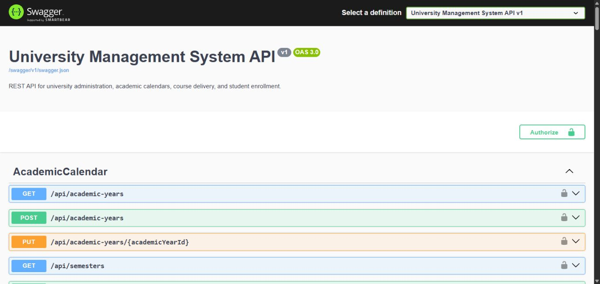

# University Management System

A full-stack university management platform for academic staff and students. The system combines role-based course administration, academic calendar management, registration workflows, assessments, announcements, and realtime enrollment updates in one Next.js and ASP.NET Core application.

## Highlights

- **Role-based workspaces** for Admins, Doctors, Teaching Assistants, and Students.
- **Academic calendar management** for academic years, semesters, registration windows, add/drop dates, publication controls, and course offerings.
- **Course registration** with search, semester filtering, application status, and capacity-aware enrollment.
- **Realtime waitlist updates** using SignalR. Students can see enrollment changes without refreshing the page when a seat becomes available.
- **Background waitlist promotion** in ASP.NET Core. A hosted worker promotes the next eligible student when capacity opens, while an outbox worker publishes reliable realtime events.
- **Interactive API documentation** through Swagger UI with an OpenAPI v3 contract and JWT bearer authorization support.
- **Assessment tools** for quizzes, questionnaires, grading, due dates, and student feedback.
- **Announcements and comments** inside course pages.
- **Server Actions** in the frontend BFF layer for authenticated client-to-server operations.

## Screenshots

The screenshots below show the current application UI and seeded local demo data.

### Student course dashboard

Registered courses, semester status, and the quiz calendar are grouped into the same student workspace.



### Course registration and live updates

Students can search the catalogue, select a semester, and see the realtime connection state alongside enrollment status.



### Course detail and collaboration

Course announcements, questionnaires, grades, staff information, and comments live under one course page.



### Academic calendar administration

The calendar uses compact tabs for academic years, semesters, and offerings. Semester cards separate term dates, Cairo registration windows, and add/drop windows so the important dates can be scanned quickly.



### Swagger API documentation

Swagger groups the REST endpoints by controller, shows request and response schemas, and provides an **Authorize** control for testing protected endpoints with a JWT.



## Technology

### Frontend

- Next.js 16 App Router
- TypeScript
- Tailwind CSS
- Radix/shadcn UI primitives
- `@microsoft/signalr` for realtime enrollment updates
- Server Actions for the frontend BFF layer

### Backend

- ASP.NET Core Web API
- Entity Framework Core with SQL Server
- JWT authentication and role-based authorization
- Swagger UI and an OpenAPI v3 endpoint for interactive API exploration
- SignalR hub for enrollment events
- Hosted background workers for waitlist promotion and outbox delivery
- Database migrations for academic calendar, offerings, waitlists, and outbox messages

## Project structure

```text
frontend/
  app/                  Next.js routes, pages, actions, and UI
  components/           Shared layout and UI primitives
  public/               Static frontend assets

UMS.Api/
  Controllers/          HTTP API endpoints
  Hubs/                 SignalR hubs
  Models/               EF Core entities and enums
  Services/             Enrollment, calendar, token, and worker services
  Data/                 DbContext and demo seeding
  Migrations/           EF Core migrations

screenshots/            Current README screenshots
docker-compose.yml      SQL Server, API, and frontend development stack
```

## Backend API documentation

When the API runs with `ASPNETCORE_ENVIRONMENT=Development`, the documentation endpoints are available at:

| Resource | URL | Purpose |
| --- | --- | --- |
| Swagger UI | [http://localhost:5219/swagger](http://localhost:5219/swagger) | Browse endpoints, inspect schemas, and send test requests |
| Swagger JSON | [http://localhost:5219/swagger/v1/swagger.json](http://localhost:5219/swagger/v1/swagger.json) | OpenAPI v3 contract generated by Swagger |
| OpenAPI JSON | [http://localhost:5219/openapi/v1.json](http://localhost:5219/openapi/v1.json) | ASP.NET Core's built-in OpenAPI document |

Swagger uses the same controllers and DTOs as the application. It covers the following API areas:

| Area | Base route | Examples |
| --- | --- | --- |
| Authentication | `/api/auth` | Log in and create users |
| Academic calendar | `/api/academic-years`, `/api/semesters`, `/api/offerings` | Manage years, terms, dates, and course offerings |
| Courses and staff | `/api/courses`, `/api/staff`, `/api/staff-courses`, `/api/students` | Manage courses, profiles, and teaching assignments |
| Enrollment | `/api/enrollments` | Register, review, withdraw, join a waitlist, and leave a waitlist |
| Course delivery | `/api/announcements`, `/api/quizzes`, `/api/questionnaires`, `/api/course-contents` | Deliver learning material and assessments |
| System health | `/api/health` | Check API availability |

### Authenticate in Swagger

1. Call `POST /api/auth/login` with a development account to receive an access token.
2. Select **Authorize** at the top of Swagger UI.
3. Paste the token as `Bearer {token}`.
4. Swagger includes the authorization header in subsequent protected requests.

The Swagger UI is enabled only in the Development environment. Production deployments should expose API documentation through an authenticated internal route or a separately published API portal.

## Run locally

### Prerequisites

- Docker Desktop
- Node.js 18 or newer (for frontend-only work)
- .NET 8 SDK (for backend-only work)

### Start the full stack

```bash
docker compose up --build
```

The services are available at:

- Frontend: [http://localhost:3000](http://localhost:3000)
- API: [http://localhost:5219](http://localhost:5219)
- SQL Server: `localhost:14333`

The API applies migrations and seeds demo data on startup. The seeded demo accounts use the password `password` in the local development environment.

### Run the frontend without Docker

```bash
cd frontend
npm install
npm run dev
```

## Realtime enrollment flow

1. A student registers for a full course and is placed on the waitlist when capacity is reached.
2. The enrollment service stores the waitlist position and writes an outbox message in the same database transaction.
3. The `WaitlistPromotionWorker` periodically checks published offerings during registration or add/drop windows.
4. When a seat opens, the worker promotes the next waitlisted enrollment.
5. The `EnrollmentOutboxWorker` delivers the event through `EnrollmentHub`.
6. The student’s Next.js page receives the SignalR event and updates the visible status without a full-page reload.

This keeps the UI responsive while giving the backend a reliable place to handle retries, ordering, and capacity checks.

## User roles

| Role | Main capabilities |
| --- | --- |
| **Admin** | Manage staff, courses, academic years, semesters, offerings, and publication state |
| **Doctor** | Manage assigned courses, announcements, quizzes, questionnaires, and grades |
| **Teaching Assistant** | Support assigned courses, assessments, announcements, and grading workflows |
| **Student** | Browse offerings, register or join waitlists, view courses, complete assessments, and comment on announcements |

## Development checks

```bash
# Frontend lint
cd frontend
npm run lint

# Backend build
dotnet build ../UMS.Api/UMS.Api.csproj --no-restore
```

The repository may contain unrelated legacy TypeScript diagnostics outside the files being changed. The commands above are the targeted checks used for the current frontend and backend work.
